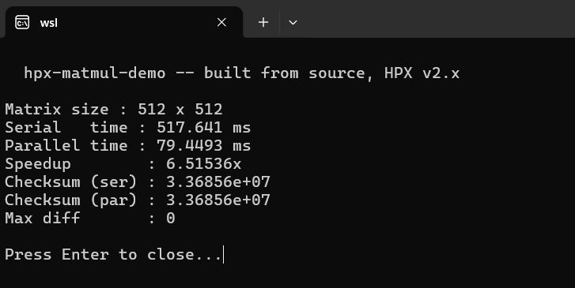

# HPX Parallel Matrix Multiplication Demo

N×N matrix multiply parallelised with `hpx::for_loop` and `hpx::execution::par`.
Each row of the output is independent, so the outer loop maps directly onto HPX worker threads with no data races.

## Output



## Build

```bash
cmake -DHPX_DIR=/usr/local/lib/cmake/HPX -B build .
cmake --build build --parallel $(nproc)
```

## Run

```bash
./build/matmul_hpx          # N=512 (default)
./build/matmul_hpx 256      # custom N
```

## Installing HPX

**Ubuntu/Debian (recommended — vcpkg):**
```bash
git clone https://github.com/microsoft/vcpkg && ./vcpkg/bootstrap-vcpkg.sh
./vcpkg/vcpkg install hpx
```

**Ubuntu — build from source:**
```bash
sudo apt install cmake ninja-build libboost-all-dev hwloc libasio-dev
git clone https://github.com/STEllAR-GROUP/hpx && cd hpx
cmake -B build -GNinja -DCMAKE_BUILD_TYPE=Release
cmake --build build -j$(nproc)
sudo cmake --install build
```

Full guide: https://hpx-docs.stellar-group.org/latest/html/manual/building_hpx.html

## About

GSoC 2026 demo for STEllAR GROUP / STORM — Rahul Surya, MSc HPC, University of Edinburgh.
